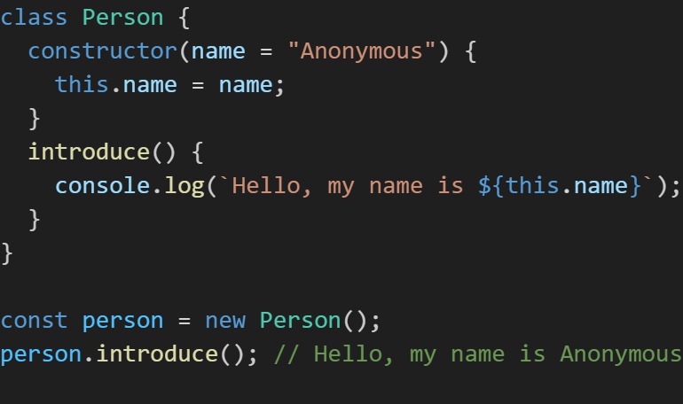
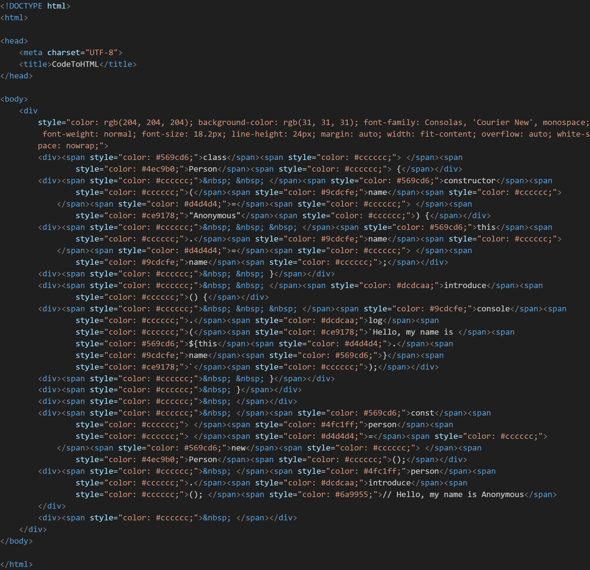
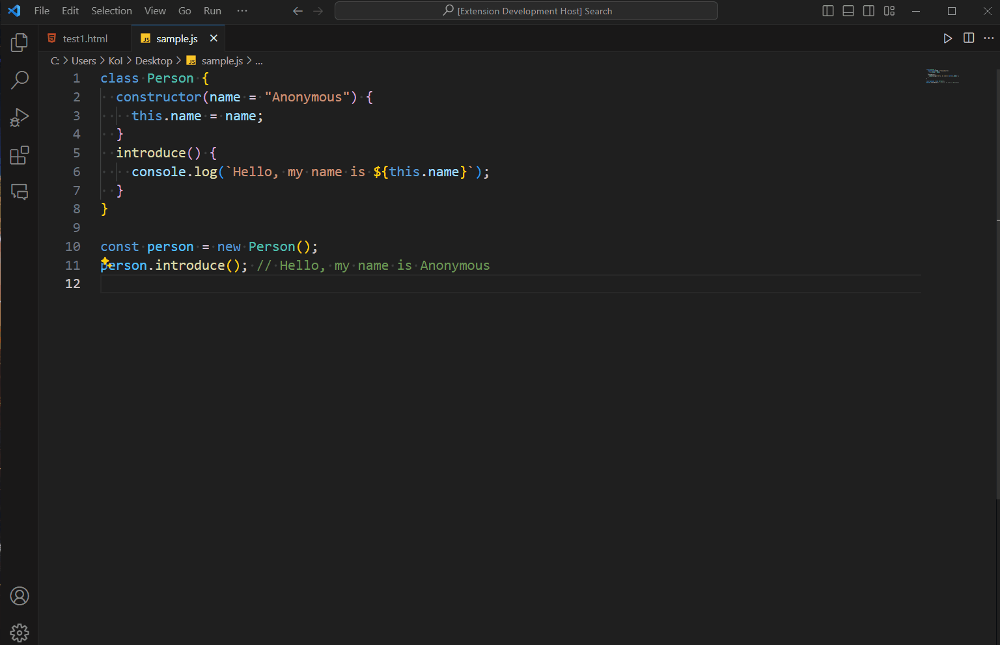
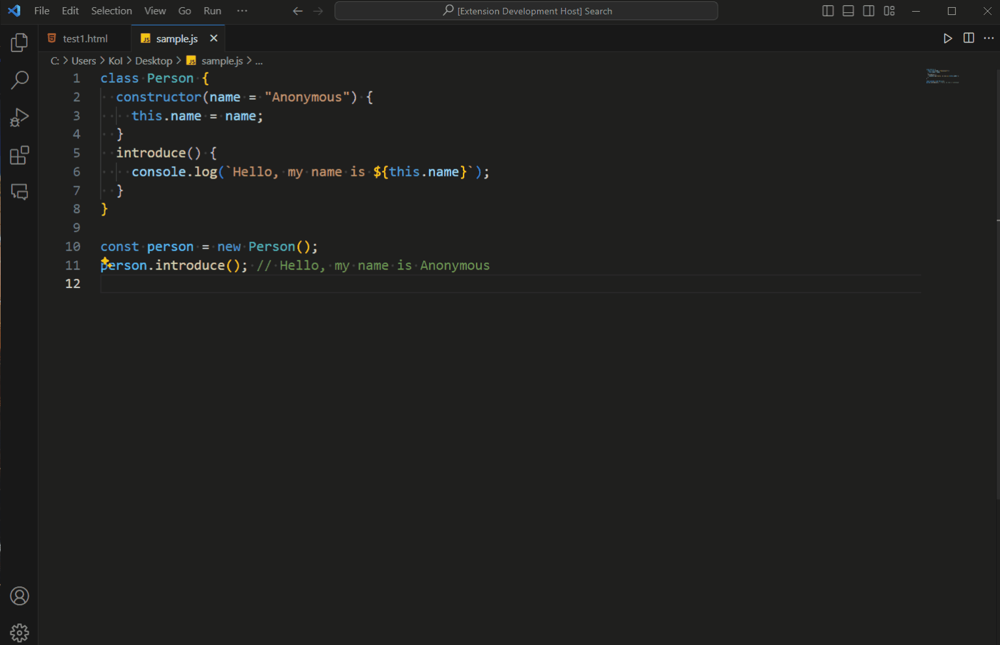
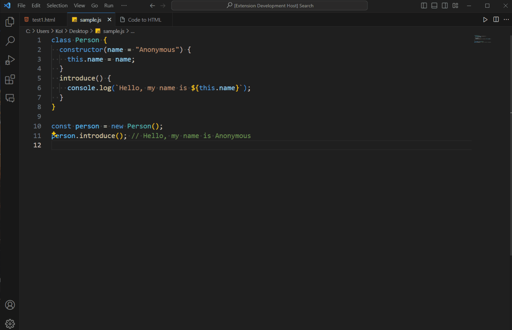

<!-- GitHub README -->
<picture>
  <source media="(prefers-color-scheme: light)" srcset="https://raw.githubusercontent.com/Aniny21/CodeToHTML/main/demo/logo_light.png">
  <source media="(prefers-color-scheme: dark)" srcset="https://raw.githubusercontent.com/Aniny21/CodeToHTML/main/demo/logo_dark.png">
  
</picture>

<!-- Visual Studio Marketplace -->
<!--  -->

# Overview
CodeToHTML is a Visual Studio Code extension that allows you to convert source code to HTML, PDF and images with syntax highlighting.

# Installation
[Visual Studio Code Marketplace](https://marketplace.visualstudio.com/items?itemName=Aniny.codetohtml)

1. Open Visual Studio Code
2. Press `Ctrl + Shift + X` to open the Extensions view
3. Find and select `CodeToHTML`
5. Click the `Install` button

# Features
- Convert source code to HTML
- Convert source code to PDF with selectable text
- Convert source code to images (PNG, JPEG, SVG)

# Example
For example, you can convert the following JavaScript code to HTML.

## Original JavaScript code

  

## Converted HTML code

  

# Usage
1. Open the source code file you want to convert
2. Open the command palette by pressing `Ctrl + Shift + P`
3. Type `CodeToHTML` and select `[CodeToHTML] Code to HTML`
4. The Webview will open with the HTML code

## Convert to HTML

- Select Code To `HTML`
- From `Structure` select the structure of the HTML
- From `Text Wrap` select the text wrapping of the HTML
- From `Max Length` select the maximum length of text wrapping

## Convert to PDF

- Select Code To `PDF`
- From `Font(.ttf)` select the font file (optional)
- From `Text Wrap` select the text wrapping of the PDF
- From `Max Length` select the maximum length of text wrapping

## Convert to Image

- Select Code To `Image`
- From `Image Type` select the image type (PNG, JPEG, SVG)
- From `Text Wrap` select the text wrapping of the image
- From `Max Length` select the maximum length of text wrapping

# Release Notes

## 1.0.0
Initial release of CodeToHTML

# License
This extension is licensed under the [MIT License](./LICENSE).

# Credits
- [jsPDF](https://github.com/parallax/jsPDF) - MIT License
- [dom-to-image-more](https://github.com/1904labs/dom-to-image-more) - MIT License